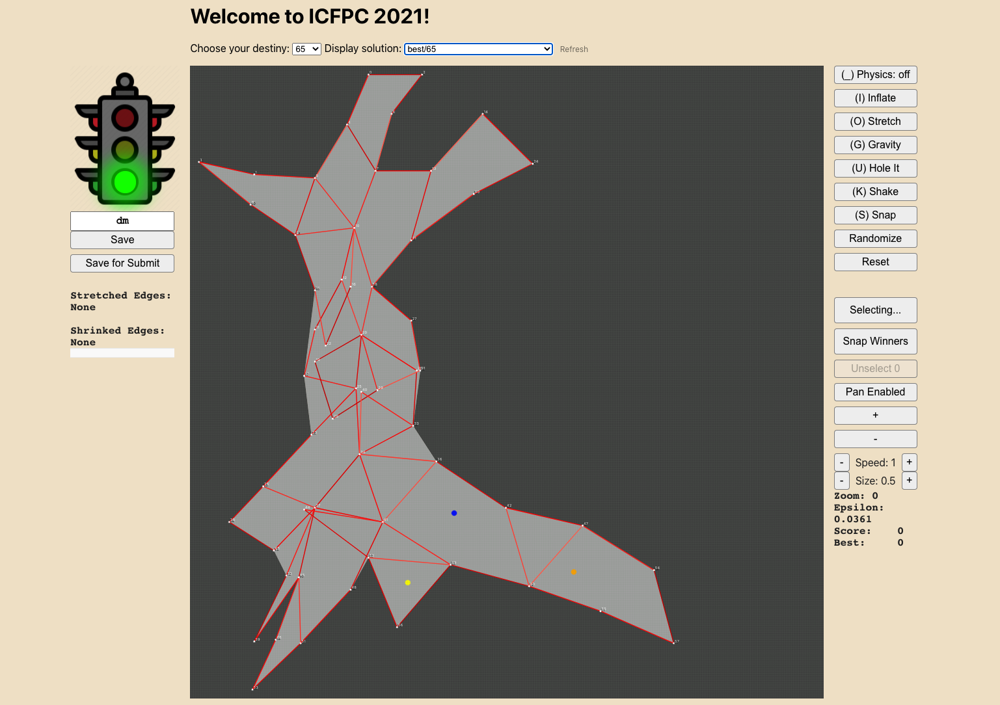

# ICFPC 2021
# Snakes, Monkeys and Two Smoking Lambdas

## Members

- Dmitry K.
- Dmitry P.
- Mikhail K.
- Oleg G.
- Victor K.
- Vitaly A.

## Languages used
 - Javascript (UI)
 - Python (attempts at solvers)

## Solution



Our main approach was to build user interface tool to assist the human in manually solving the puzzles.
At some it became obvious that automated solvers approach is not fruitfull for us so we went all-in on this UI.
Over time it grow in functionality so much and so that we started calling it `ICFPC IDE`.
Here is overview of main funtionality:

- `Physics: on/off`
  - Enables spring forces on edges that helps the vertices to stabilize
- `Inflate`
  - Moves points out of each other. This is helpful in untangling the vertex mess
- `Hole In`
  - Applies gravity force at each of the hole vertices.
    Helps to move the points closer to hole edges.
- `Glue Points`
  - Attaches points to fixed position so that they don't move when physics is enabled
- `Snap Winners`
  - Glues points that are located in the hole vertices
- `Snap`
  - Snaps points to integer coordiantes
- `Traffic Light`
  - Shows red/green depending if solution is good for submittion
- `Save`
  - Saves the solution as checkpoint (with glued points) or for submission (clean json).


## Usage

```
cd ui/ && yarn install && yarn dev
```

Navigate to [http://localhost:3000]()
